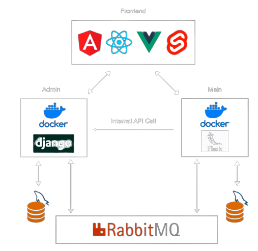

# Python Microservices Web App - Django, Flask, React, DevOps

기존 소프트웨어는 Monolothic한 성격을 지니고 있다. 이 경우 하나의 애플리케이션이 다른 애플리케이션과 결합되어 있어 유지관리 및 운영 측면에서 독립적인 기능 업데이트 및 변경이 어려운 점과 특정 서비스만 스케일링이 불가능한 문제를 마주하게 된다. 이런 문제들을 해결하기 위해 등장한 것이 MSA(Micro Service Architecture)이다.

MSA는 각각을 Micro하게 나눈 서비스 지향 아키텍처로, 필요한 부분만 업데이트 및 배포가 가능하다. MSA는 API를 통해서만 상호작용할 수 있으며, 각각의 서비스는 end-point를 API 형태로 외부에 노출하고, 실질적인 세부 사항은 모두 추상화한다.

하지만, MSA를 도입함에 있어 문제점이 발생한다.

- Monolothic 아키텍처에 비해 서비스가 분산이 되어 있기 때문에 서비스 간 통신에 있어 복잡성이 증가
- 데이터에 대한 트랜잭션 유지 어려움
- 장애 추적 및 모니터링에 대한 어려움
- 통합 테스트에 대한 어려움

Service Mesh는 인프라 레이어에서 처리하는 방법이다.

- 트래픽 제어
- 세분화된 보안 정책 적용
- Tracing 제공

본 프로젝트는 Istio를 통한 서비스 메시에 대한 이해와 활용을 목적으로 한다.

### [Istio 실습](#istio-실습-1)

## Architecture



상기와 같이 앱을 서로 통신하는 작은 부분으로 나눌 수 있다. 이를 통해 트래픽을 기반으로 애플리케이션을 쉽게 확장할 수 있으며, 일부 장애가 전체 서비스로 확장될 가능성이 낮다.

### [Bakend](https://github.com/ddung1203/python-microservices)

### [Frontend](https://github.com/ddung1203/react-crud)

### [DevOps](https://github.com/ddung1203/django-argocd)


## Kubernetes settings

| name | cpu | memory | ip |
| --- | --- | --- | --- |
| k8s-master | 4 | 6144 | 192.168.100.100 |
| k8s-node1 | 2 | 4096 | 192.168.100.101 |
| k8s-node2 | 2 | 4096 | 192.168.100.102 |
| k8s-node3 | 2 | 4096 | 192.168.100.103 |

기본적으로 NFS를 이용하여 storage를 사용하는 `Pod`를 배포하기 위해 Kubernetes Cluster 상에서 NFS Storage를 사용할 수 있도록 Provisioner를 설정하였다. 이는 ServiceAccount로서 Kubernetes Cluster 상에서 `PV`를 배포할 수 있도록 권한을 부여해 주는 역할을 한다. 

[TIL - 동적 프로비저닝](https://github.com/ddung1203/TIL/blob/main/k8s/10_Volume.md#%EB%8F%99%EC%A0%81-%ED%94%84%EB%A1%9C%EB%B9%84%EC%A0%80%EB%8B%9D)


### Admin

`admin.yaml`

Service는 `admin` 레이블을 가진 `Pod`를 선택한다. 8000 포트로 요청을 받아 해당 `Pod`의 8000 포트로 전달한다.

Deployment는 v1 ~ v3 각각 3개의 복제본을 생성하며, `admin` 레이블을 가진 `Pod`에 대한 설정을 지정한다. 또한 Pod Template에서는 `admin` 컨테이너를 정의하고, `python manage.py runserver 0.0.0.0:8000` 명령을 실행한다.

추가로 livenessProbe와 readinessProbe가 정의되어 있으며, `/api/products` 경로로 8000 포트에 HTTP GET 요청을 보내고 응답을 기다린다. initialDelaySeconds, periodSeconds 및 timeoutSeconds는 livenessProbe가 시작되기까지의 지연 시간, 주기적으로 실행되는 간격 및 타임아웃을 나타낸다.

또한 Pod Template에는 `initContainers`도 정의되어 있다. `initContainer`는 파드 내에서 실행되는 컨테이너로, 주로 초기화 작업을 수행하는 데 사용되며 하기 코드에서는 migration이라는 이름의 `initContainer`가 정의되어 있다. `initContainer`는 `python manage.py migrate` 명령을 실행하여 데이터베이스 마이그레이션 작업을 수행한다.

``` yaml
apiVersion: v1
kind: Service
metadata:
  name: admin-svc
  labels:
    app: admin
spec:
  selector:
    app: admin
  ports:
    - port: 8000
---
apiVersion: apps/v1
kind: Deployment
metadata:
  name: admin-deploy-v1
  labels:
    app: admin
    version: v1
spec:
  replicas: 1
  selector:
    matchLabels:
      app: admin
      version: v1
  template:
    metadata:
      labels:
        app: admin
        version: v1
    spec:
      containers:
        - name: admin
          image: ddung1203/admin:10
          command: ["python", "manage.py", "runserver", "0.0.0.0:8000"]
          ports:
            - containerPort: 8000
          livenessProbe:
            httpGet:
              path: /api/products
              port: 8000
            initialDelaySeconds: 30
            periodSeconds: 10
            timeoutSeconds: 5
          readinessProbe:
            httpGet:
              path: /api/products
              port: 8000
            initialDelaySeconds: 5
            periodSeconds: 2
            timeoutSeconds: 1
---
# v2 및 v3
```

`admin-mysql-deployment.yaml`

하기 코드는 Kubernetes 클러스터 내에서 실행되는 MySQL 데이터베이스를 위한 Service와 Deployment를 정의한다.

먼저, `admin-mysql` Service는 MySQL 데이터베이스에 대한 접근을 제공하기 위해 사용된다. Service는 3306 포트로 접근 가능하며, `admin-mysql` 레이블을 가진 파드를 선택한다.

다음으로, `admin-mysql` Deployment는 `admin-mysql` 레이블을 가진 파드를 선택하며 배포 전략은 Recreate로 설정되어 있어 파드를 재생성하는 방식으로 업데이트를 수행한다.

Pod Template에서는 MySQL 컨테이너가 정의되어 있다. 컨테이너에는 환경 변수가 설정되어 있으며, 이는 `admin-mysql-secret`이라는 이름의 Secret에서 값을 가져온다. 환경 변수로는 `MYSQL_DATABASE`, `MYSQL_PASSWORD`, `MYSQL_ROOT_PASSWORD가` 있으며, 컨테이너는 3306 포트를 열고 `admin-mysql`이라는 이름으로 서비스에 연결된다.

컨테이너에는 `admin-mysql-persistent-storage`라는 이름의 볼륨이 마운트되어 있다. 이는 MySQL 데이터를 지속적으로 저장하기 위한 볼륨으로, `/var/lib/mysql` 경로에 마운트된다.

또한, 컨테이너에는 자원 요청이 정의되어 있으며, CPU는 `500m(0.5)`를 요청하고, 메모리는 `1Gi`를 요청한다.

컨테이너에는 `livenessProbe`와 `readinessProbe`가 정의되어 있다. `livenessProbe`는 컨테이너의 상태를 확인하기 위해 `mysqladmin ping -p$MYSQL_PASSWORD` 명령을 실행한다. `initialDelaySeconds`, `periodSeconds` 및 `timeoutSeconds`는 `livenessProbe`가 시작되기까지의 지연 시간, 주기적으로 실행되는 간격 및 타임아웃을 나타낸다.

마지막으로 배포에는 `admin-mysql-pv-claim`라는 이름의 PVC는 NFS 클라이언트를 위한 `storageClassName`을 사용하며, ReadWriteMany 액세스 모드로 설정되어 여러 파드에서 동시에 읽고 쓸 수 있다. 요청된 스토리지는 5Gi로 지정되어 있다.

``` yaml
apiVersion: v1
kind: Service
metadata:
  name: admin-mysql
  labels:
    app: admin-mysql
spec:
  selector:
    app: admin-mysql
  ports:
  - port: 3306
---
apiVersion: apps/v1
kind: Deployment
metadata:
  name: admin-mysql
  labels:
    app: admin-mysql
    version: v1
spec:
  selector:
    matchLabels:
      app: admin-mysql
      version: v1
  strategy:
    type: Recreate
  template:
    metadata:
      labels:
        app: admin-mysql
        version: v1
    spec:
      containers:
      - image: mysql:8.0.33-debian
        name: admin-mysql
        env:
        - name: MYSQL_DATABASE
          valueFrom:
            secretKeyRef:
              name: admin-mysql-secret
              key: MYSQL_DATABASE
        - name: MYSQL_PASSWORD
          valueFrom:
            secretKeyRef:
              name: admin-mysql-secret
              key: MYSQL_PASSWORD
        - name: MYSQL_ROOT_PASSWORD
          valueFrom:
            secretKeyRef:
              name: admin-mysql-secret
              key: MYSQL_ROOT_PASSWORD
        ports:
        - containerPort: 3306
          name: admin-mysql
        volumeMounts:
        - name: admin-mysql-persistent-storage
          mountPath: /var/lib/mysql
        resources:
          requests:
            cpu: 500m
            memory: 1Gi
        livenessProbe:
          exec:
            command: ["/bin/sh", "-c", "mysqladmin ping -p$MYSQL_PASSWORD"]
          initialDelaySeconds: 30
          periodSeconds: 10
          timeoutSeconds: 5
        readinessProbe:
          exec:
            # Check we can execute queries over TCP (skip-networking is off).
            command: ["/bin/sh", "-c", "mysqladmin ping -p$MYSQL_PASSWORD"]
          initialDelaySeconds: 5
          periodSeconds: 2
          timeoutSeconds: 1
      volumes:
      - name: admin-mysql-persistent-storage
        persistentVolumeClaim:
          claimName: admin-mysql-pv-claim
---
apiVersion: v1
kind: PersistentVolumeClaim
metadata:
  name: admin-mysql-pv-claim
spec:
  storageClassName: nfs-client
  accessModes:
    - ReadWriteMany
  resources:
    requests:
      storage: 5Gi
```

`admin-mysql-secret.yaml`
``` yaml
apiVersion: v1
kind: Secret
metadata:
  name: admin-mysql-secret
type: Opaque
data:
  MYSQL_DATABASE: YWRtaW4=
  MYSQL_PASSWORD: cm9vdA==
  MYSQL_ROOT_PASSWORD: cm9vdA==
```

`Dockerfile`

admin 이미지의 Dockerfile

``` Dockerfile
FROM python:3.10.6
ENV PYTHONUNBUFFERED 1
WORKDIR /app
COPY requirements.txt /app/requirements.txt
RUN pip install -r requirements.txt
COPY . /app

RUN python manage.py makemigrations products

CMD ["python3", "manage.py", "runserver", "0.0.0.0:8000"]
EXPOSE 8000
```

admin queue 이미지의 Dockerfile

``` Dockerfile
FROM python:3.10.6
ENV PYTHONUNBUFFERED 1
WORKDIR /app
COPY requirements.txt /app/requirements.txt
RUN pip install -r requirements.txt
COPY . /app

CMD ["python", "consumer.py"]
```

`backend-ing.yaml`

Ingress 리소스는 Nginx Ingress 컨트롤러의 어노테이션을 포함하고 있다. nginx.ingress.kubernetes.io/rewrite-target 어노테이션은 URL을 재작성하는 데 사용되며, 이 경우 `/admin` 경로는 `/`로, `/main` 경로는 `/`로 재작성된다.

Ingress 리소스의 구성은 다음과 같다.

- spec 섹션은 Ingress의 규칙 및 설정을 정의
- rules 섹션은 호스트와 해당 호스트로의 요청에 대한 경로를 정의
- host는 호스트 패턴을 지정. `*.nip.io`는 모든 서브도메인에 대해 `nip.io` 도메인을 사용하겠다는 것을 의미
- http는 HTTP 프로토콜에 대한 경로 및 백엔드 서비스를 정의
- paths는 경로 및 해당 경로로의 요청을 처리할 백엔드 서비스를 지정
- path는 요청 경로를 나타내며, `/admin(/|$)(.*)`는 `/admin`으로 시작하는 모든 경로 및 하위 경로를 나타낸다. `/main(/|$)(.*)`는 `/main`으로 시작하는 모든 경로 및 하위 경로를 나타낸다.
- pathType은 경로 유형을 지정. Prefix는 경로 접두사를 기준으로 매칭됨을 의미.

위의 Ingress 리소스를 사용하면 `/admin` 및 `/main` 경로에 대한 요청이 각각 `admin-svc-np`와 `main-svc-np`라는 이름의 서비스로 전달되도록 설정된다. 이를 통해 클러스터 외부에서 애플리케이션의 다른 경로에 대한 액세스를 가능하게 한다.

``` yaml
apiVersion: networking.k8s.io/v1
kind: Ingress
metadata:
  name: react-ing
  annotations:
    nginx.ingress.kubernetes.io/rewrite-target: /$2
spec:
  rules:
    - host: '*.nip.io'
      http:
        paths:
          - path: /admin(/|$)(.*)
            pathType: Prefix
            backend:
              service:
                name: admin-svc-np
                port:
                  number: 8000
          - path: /main(/|$)(.*)
            pathType: Prefix
            backend:
              service:
                name: main-svc-np
                port:
                  number: 5000
```

`rabbitmq.yaml`

RabbitMQ는 오픈 소스 메시지 브로커 소프트웨어이다. 다양한 프로토콜을 지원하며, 분산 메시징 시스템에서 사용되어 복잡한 애플리케이션 간에 메시지 전달을 단순화하고 확장성을 제공한다.

- 메시지 큐: RabbitMQ는 메시지 큐를 통해 메시지를 안전하게 저장하고 전달한다. Producer는 메시지를 큐에 전송하고, Consumer는 큐에서 메시지를 가져와 처리할 수 있다.
- AMQP 프로토콜: RabbitMQ는 AMQP(Advanced Message Queuing Protocol) 프로토콜을 기반으로 동작한다. AMQP는 메시지 브로커와 클라이언트 간에 안정적인 메시지 전달을 위한 표준 프로토콜이다.
- 큐 패턴: RabbitMQ는 다양한 큐 패턴을 지원한다. Direct, Fanout, Topic, Headers 등의 패턴을 사용하여 메시지 라우팅과 구독을 관리할 수 있다.
- Publish-Subscribe 모델: RabbitMQ는 발행-구독(Publish-Subscribe) 모델을 지원하여 하나의 메시지를 여러 개의 소비자에게 전달할 수 있다. 이를 통해 다수의 애플리케이션 간에 이벤트 기반 통신을 구축할 수 있다.
- 메시지 지속성: RabbitMQ는 메시지를 디스크에 지속적으로 저장하여 안전하게 보호한다. 이를 통해 메시지 손실이나 장애 발생 시에도 데이터의 안정성을 유지할 수 있다.
- 클러스터링: RabbitMQ는 여러 노드로 구성된 클러스터를 형성하여 고가용성과 확장성을 제공한다. 클러스터링을 통해 메시지 처리 능력을 향상시키고 장애 복구 기능을 제공할 수 있다.
- 관리 도구: RabbitMQ는 웹 기반 관리 도구를 제공하여 관리자가 큐, 교환기, 바인딩 등을 모니터링하고 구성할 수 있다. 또한, 통계 정보와 로그를 확인하여 시스템 성능을 모니터링할 수 있다.

``` yaml
apiVersion: v1
kind: Service
metadata:
  name: rabbitmq-svc
  labels:
    app: queue
spec:
  selector:
    app: rabbitmq
  ports:
  - port: 5672
    targetPort: 5672
    name: amqp
  - port: 15672
    targetPort: 15672
    name: console 
---
apiVersion: apps/v1
kind: Deployment
metadata:
  name: rabbitmq-deploy
  labels:
    app: queue
spec:
  replicas: 1
  selector:
    matchLabels:
      app: rabbitmq
      version: v1
  template:
    metadata:
      labels:
        app: rabbitmq
        version: v1
    spec:
      containers:
        - name: rabbitmq
          image: rabbitmq:management
          ports:
            - containerPort: 5672
              protocol: TCP
            - containerPort: 15672
              protocol: TCP
```

## Istio 실습

### Istio 기본 

**[TIL - Istio](https://github.com/ddung1203/TIL/blob/main/k8s/19_Istio.md)**

Service Mesh는 일반적으로 Sidecar Pattern으로 구성된다.

**네임스페이스 생성**

``` bash
kubectl create ns istio
```

**사이드카 프록시 인젝션**

namespace에 레이블을 추가하면 istiod(오퍼레이터)가 해당 namespace의 pod spec에 자동으로 sidecar 설정을 주입

``` bash
kubectl lable ns istio istio-injection=enabled
```

istio가 설치되면 kube-apiserver에 mutating webhook admission controller가 생성된다. 이 controller는 Pod 생성 event가 발생하면 sidecar로 proxy container를 자동으로 추가해주는 plugin이다.

mutatingwebhookconfigutation을 확인하면, matchLabels에 istio-injection=enabled인 namespace를 대상으로 sidecar injection을 수행하도록 되어있다.

**label 제거**

``` bash
kubectl label ns istio istio-injection-
```

**수동 sidecar injection**

``` bash
istioctl kube-inject -f ./admin.yaml | kubectl apply -f -
```

> 참고
> 
> initContainer는 사이드카가 시작되기 전에 실행된다. 컨테이너가 Istio의 initContainer보다 먼저 실행되면 보안 상 좋지 않다. 또한 Istio 이후에 컨테이너가 실행되면 네트워크에 액세스할 수 없다.
> initContainer에서 network I/O를 수행하지 않도록 해야한다. 연결이 필요한 initContainer를 사용해야 하는 경우 work around가 필요하다.
> 만약 InitContainer를 사용하는 경우, Pod의 init이 완료되지 않는다.
>
> 따라서, Flask와 Django의 db init 및 migrate의 경우 Pod 배포 후 exec로 작업을 하였다.
>
> [admin의 initContainer 삭제 필요](#admin)
>
> [K8s Istio sidecar injection with other init containers](https://discuss.istio.io/t/k8s-istio-sidecar-injection-with-other-init-containers/845)

``` bash
#!/usr/bin/sh

kubectl exec -it deployment.apps/admin-deploy -- python manage.py migrate

kubectl exec -it deployment.apps/main-deploy -- flask --app manager db init
kubectl exec -it deployment.apps/main-deploy -- flask --app manager db migrate
kubectl exec -it deployment.apps/main-deploy -- flask --app manager db upgrade
```

### Kiali

``` bash
istioctl dashboard kiali
```

하기와 같이 실제 구축한 애플리케이션의 requests per second 값이나 보안통신이 되고 있는지 등 여러 내역들에 대해서 서비스 매쉬가 그래포로 그려지면서 한눈에 쉽게 확인할 수 있다.


### Istio Gateway 및 VirtualService

목적: 서비스 간의 트래픽을 관리하고 보안, 트래픽 라우팅, 트래픽 제어 등의 기능을 제공하기 위한 Istio 컴포넌트

기능

- 서비스 트래픽 제어
- 인바운드 및 아웃바운드 트래픽 제어
- 가상 서비스 및 라우팅

**Istio Gateway**

Public Cloud 환경의 K8s에서 배포를 해야할 경우, 외부에서 접근할 수 있도록 LoadBalancer 혹은 Ingress를 사용한다. 하지만 모든 Service를 LoadBalancer 타입으로 생성하기엔 비용 문제가 발생하며, 이 문제를 해결하기 위해 Ingress를 사용한다. Istio는 여기서 Service Mesh의 경계에서 Inbound/Outbound 트래픽을 처리할 수 있는 LoadBalancer를 제공하며, 이를 `Gateway`라는 Istio Resource로 설정할 수 있다.

`istioctl install --set profile=demo -y`로 Istio를 설치했을 때, 하기와 같이 ingressgate와 egressgateway가 생성된다. 

``` bash
 vagrant@k8s-master > ~ > kubectl get po -n istio-system
NAME                                   READY   STATUS    RESTARTS       AGE
grafana-56bdf8bf85-p44gb               1/1     Running   0              3d
istio-egressgateway-85649899f8-bsb4k   1/1     Running   0              3d
istio-ingressgateway-f56888458-5pxtl   1/1     Running   0              3d
istiod-64848b6c78-w8s4d                1/1     Running   0              3d
jaeger-76cd7c7566-xnz5j                1/1     Running   0              3d
kiali-7d7df7458c-h8w4k                 1/1     Running   0              3d
prometheus-85949fddb-vr8pz             2/2     Running   0              3d                                                 
```

Gateway를 통해 설정할 수 있는 항목

- Port
- Protocol
- SNI
- TLS

**VirtualService**

VirtualService는 Envoy 프록시에게 어떤 목적지로 어떻게 트래픽을 전달할 지 알려주는 역할을 수행한다. 이를 통해 Routing 동작을 사용하자 원하는 대로 수정하여 Kubernetes에서 할 수 없었던 기능들을 제공한다.

- Canary
- HTTP 헤더 기반 Routing Rule
- Fault Injection

`gateway.yaml`
``` yaml
apiVersion: networking.istio.io/v1alpha3
kind: Gateway
metadata:
  name: frontend-gateway
spec:
  selector:
    istio: ingressgateway # use istio default controller
  servers:
  - port:
      number: 80
      name: http
      protocol: HTTP
    hosts:
    - "*"
---
apiVersion: networking.istio.io/v1alpha3
kind: VirtualService
metadata:
  name: frontend
spec:
  hosts:
  - "*"
  gateways:
  - frontend-gateway
  http:
  - match:
    route:
    - destination:
        host: frontend
        port:
          number: 3000
```

상기와 같이 설정 후 배포를 하면 Kiali Graph에서 하기와 같이 확인이 가능하다.

**Idle 상태**


`queue`의 경우 admin, main의 consumer가 rabbitmq를 subscribe하게 된다. 또한 admin의 v1, v2, v3로 추후 Canary 혹은 Routing Rule을 적용해보는 실습을 하기 위해 생성해 두었다.

만약 활성화된 웹 페이지의 경우 하기와 같이 트래픽이 진행된다.


Workloads 메뉴에선 현재 배포한 Workload(Deployment, StatefulSet 등)의 상태를 쉽게 파악할 수 있다.


특히 유용한 기능 중 하나는 Workload를 선택했을 때, Log를 확인이 가능하다. 


| Yello의 경우 Istio-proxy의 Log, White의 경우 rabbitmq의 Log이다.

